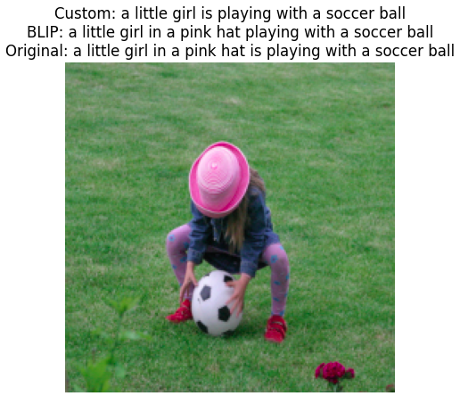
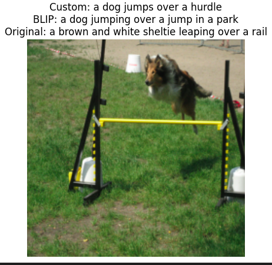

# 🧠 Custom Image Captioning Model with Attention

This project was developed as part of an assignment at the **ELTE AI Lab**, where I implemented a deep learning model to generate image captions using an encoder-decoder architecture with attention.

## 📓 Notebook

You can explore the full project in the interactive Jupyter notebook, which includes:

- Dataset preprocessing
- Vocabulary building
- Model architecture
- Training loop
- Inference and evaluation
- Sample caption outputs

📄 **Notebook:**  
[DND_Assignment_Sazid (1).ipynb](https://github.com/Sazid669/Image_captioning/blob/IFRoS-Master/DND_Assignment_Sazid%20(1).ipynb)  
(No need to download — just click and view it on GitHub!)

---

## 🛠️ Key Features

- 🔍 **Dataset**: Flickr8k
- 🧠 **Architecture**:
  - **Encoder**: Pretrained CNN (e.g. ResNet50) for feature extraction
  - **Decoder**: LSTM with Attention mechanism
- 🏷️ **Loss Function**: Cross-Entropy with Padding Masking
- 📊 **Evaluation Metric**: BLEU-1, BLEU-2, BLEU-3 Score
- ✅ **Result**: Achieved **BLEU-1 score of 74.64%**, **BLEU-2 score of 59.75%**, **BLEU-3 score of 45.57%**

---

## 🖼️ 📸 Sample Captions

Here are some captions generated by the model:

|  
|  
 
---

## 📦 Future Improvements

- Add beam search decoding for better caption quality
- Fine-tune CNN encoder during training
- Use Transformer-based architecture for comparison
- Evaluate using BLEU-4 and METEOR scores

---

## 🙏 Acknowledgements

Special thanks to **ELTE AI Lab** and the **Flickr8k dataset contributors** for making this work possible.

---

## 📬 Contact

Feel free to reach out or collaborate!

- GitHub: [Sazid669](https://github.com/Sazid669)
